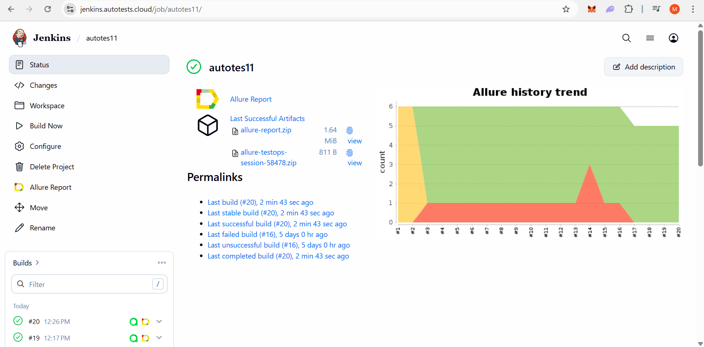
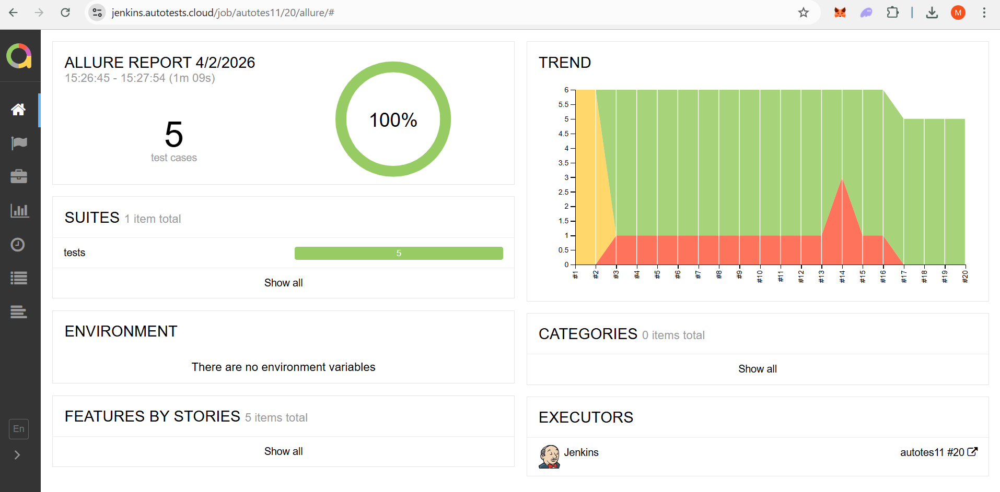
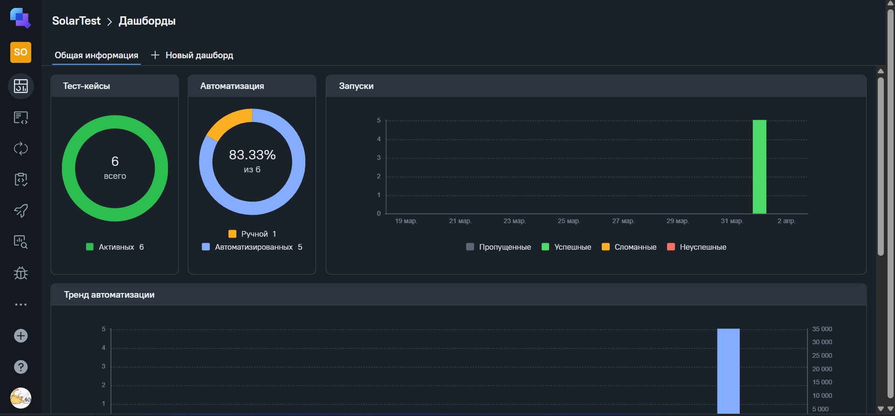
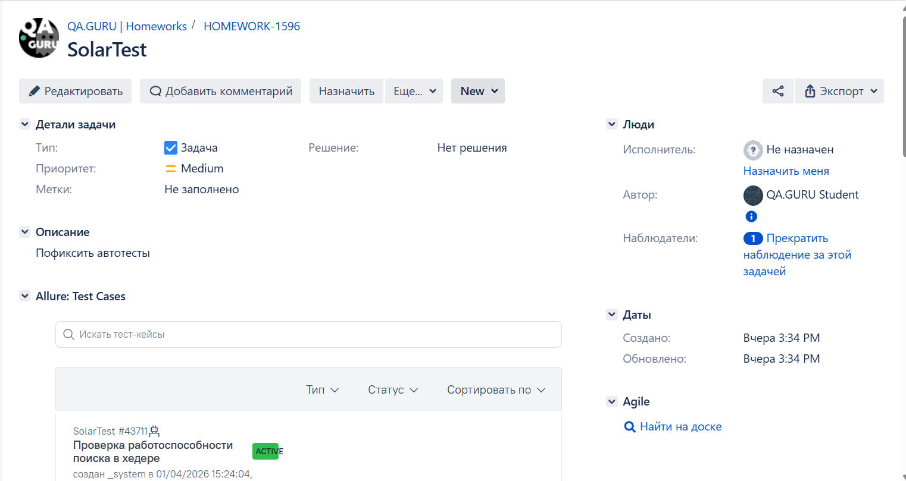
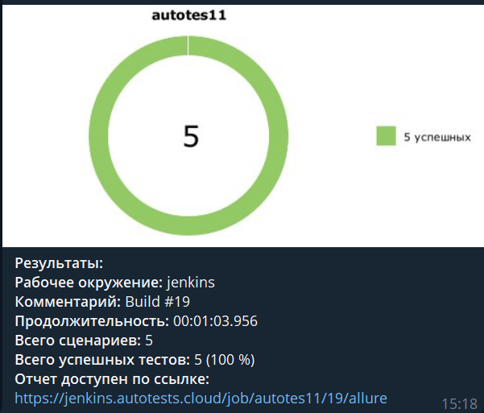

## Проект UI автотестов `rt-solar.ru`

### Используемые технологии
<p align="center">
  <code></code>
  <code></code>
  <code></code>
  <code></code>
  <code></code>
  <code></code>
  <code></code>
  <code></code>
  <code></code>
  <code></code>
  <code></code>
  <code></code>
</p>

### Что проверяем
* Поиск в хедере и переход на страницу поиска
* Открытие формы консультации и наличие обязательных полей
* Автодополнение поля компании (пример: `ПАО СБЕРБАНК`)
* Переход на страницу аналитики из хедера
* Выбор продукта и проверка открытия промо-формы

### Подготовка и запуск
```powershell
python -m venv .venv
.\.venv\Scripts\Activate.ps1
pip install -r requirements.txt
pytest
```

`.env` (в корне проекта):
```env
LOGIN=your_selenoid_login
PASSWORD=your_selenoid_password
```

###  Запуск проекта в Jenkins

### [Job](https://jenkins.autotests.cloud/job/autotes11/)

##### При нажатии на "Build Now" запускается сборка и прогон UI-тестов в удаленном браузере через Selenoid.


###  Allure report

### [Allure report build #19](https://jenkins.autotests.cloud/job/autotes11/19/allure/)

##### В отчете доступны шаги теста, вложения (screenshot, page source, console log) и ссылка на видео прогона.


###  Интеграция с Allure TestOps

### [Dashboard](https://allure.autotests.cloud/project/5159/dashboards)

##### Результаты прогонов сохраняются в Allure TestOps с дашбордами по тест-кейсам, автотестам и запускам.


###  Интеграция с Jira

##### Через интеграцию можно связывать автотесты и результаты прогонов с задачами в Jira.


###  Интеграция с Telegram

##### После завершения прогона бот отправляет краткий отчет с итогами и ссылкой на Allure.


### Видео прогона теста

<video src="images/video/test_search_company.mp4" controls width="100%"></video>

Если в вашей среде превью не отображается, файл доступен по ссылке:
[test_search_company.mp4](images/video/test_search_company.mp4)

### Примечание
Иконки сохранены локально в `images/logo_stacks/` (часть из Devicon, часть из официальных ресурсов GitHub, Allure, Qameta и Selenoid).
Скриншоты и видео тоже лежат в репозитории (в `images/`), поэтому README не зависит от внешних CDN.
